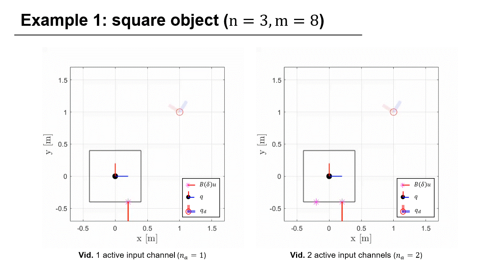

## Bio
Dongjae Lee is a visiting postdoctoral researcher at the Robotics Institute, Carnegie Mellon University, coadvised by Prof. Guanya Shi and Prof. Sebastian Scherer. He received the B.S. and M.S. degrees in Mechanical and Aerospace Engineering in 2018 and 2020, respectively, and the Ph.D. degree in Aerospace Engineering in 2025, all from Seoul National University, where he was advised by Prof. H. Jin Kim. In 2024, he was a visiting Ph.D. student in the Division of Decision and Control Systems at KTH Royal Institute of Technology, advised by Prof. Dimos V. Dimarogonas. His research interests include planning and control for robotic systems.

<!-- ---
## Research Interests
- Aerial Manipulation
- Robot-Environment Interaction
- Robust/Adaptive Control
- Trajectory Optimization
- Cooperative Control -->

---
## Research Highlight

    

        
    

    

        
    

    

        
    

    

        
    

    

        
    

    

        
    

    

        
    

---
## Recent News
- <u>[Jan. 2026]</u> One <a href="https://ieeexplore.ieee.org/document/11359671">paper</a> accepted to <a href="https://ieeexplore.ieee.org/xpl/RecentIssue.jsp?punumber=7083369">IEEE RA-L</a>.
- <u>[Aug. 2025]</u> Began postdoctoral research at <a href="https://lecar-lab.github.io/">LeCAR Lab</a> and <a href="https://theairlab.org/">AirLab</a>, <a href="https://www.ri.cmu.edu/">CMU Robotics Institute</a>.
- <u>[Aug. 2025]</u> One <a href="files/2025IJRR.pdf">paper</a> accepted to <a href="https://journals.sagepub.com/home/ijr">IJRR</a>.
- <u>[May. 2025]</u> Awarded the <a href="https://eng.nrf.re.kr/page/5301bb32-ad33-4031-8de1-a8b3275956a2?bizNo=1&uprBizNos=198,195,1">NRF Postdoctoral Fellowship for Overseas Training</a>.
- <u>[Mar. 2025]</u> Began postdoctoral research at <a href="https://larr.snu.ac.kr/">LARR, SNU</a>.
- <u>[Feb. 2025]</u> Invited to present at <a href="https://www.kias.re.kr/kias/main/main.do?&lang=en">2025 KIAS mini workshop on AI and Robotics, KIAS</a>.
- <u>[Feb. 2025]</u> Received Outstanding Doctoral Dissertation Award from <a href="https://aerospace.snu.ac.kr/en">Aerospace Engineering, SNU</a>.
- <u>[Jan. 2025]</u> One <a href="https://arxiv.org/abs/2501.16719">paper</a> accepted to <a href="https://www.ieee-ras.org/conferences-workshops/fully-sponsored/icra">IEEE ICRA</a>.
- <u>[Dec. 2024]</u> Successfully completed Ph.D. defense at <a href="https://en.snu.ac.kr/index.html">SNU</a>. 
- <u>[Nov. 2024]</u> Invited to present at <a href="https://msd.seoultech.ac.kr/en">Mechanical System Design Engineering, SeoulTech</a>.
- <u>[Sep. 2024]</u> Our <a href="https://ieeexplore.ieee.org/abstract/document/10563997">paper</a> was highlighted in <a href="https://spectrum.ieee.org/cargo-drone-2669117300">IEEE Spectrum</a>.
- <u>[Jul. 2024]</u> Invited to present at <a href="https://www.dlr.de/en/rm/about-us/institute">Institute of Robotics and Mechatronics, DLR</a>.
- <u>[Jun. 2024]</u> One <a href="https://ieeexplore.ieee.org/abstract/document/10563997">paper</a> accepted to <a href="https://ieeexplore.ieee.org/xpl/RecentIssue.jsp?punumber=7083369">IEEE RA-L</a>.
- <u>[May 2024]</u> One <a href="https://ieeexplore.ieee.org/abstract/document/10552772">paper</a> accepted to <a href="https://ieeexplore.ieee.org/xpl/RecentIssue.jsp?punumber=8856">IEEE T-ASE</a>.
- <u>[Apr. 2024]</u> One <a href="https://ieeexplore.ieee.org/abstract/document/10483266">paper</a> accepted to <a href="https://ieeexplore.ieee.org/xpl/RecentIssue.jsp?punumber=7083369">IEEE RA-L</a>.
- <u>[Apr. 2024]</u> One <a href="https://ieeexplore.ieee.org/abstract/document/10697977">paper</a> accepted to <a href="https://ieeexplore.ieee.org/xpl/RecentIssue.jsp?punumber=100">IEEE RAM</a>.
- <u>[Mar. 2024]</u> Began research visit at <a href="https://people.kth.se/~dimos/">Distributed Hybrid Systems Group, KTH</a>.